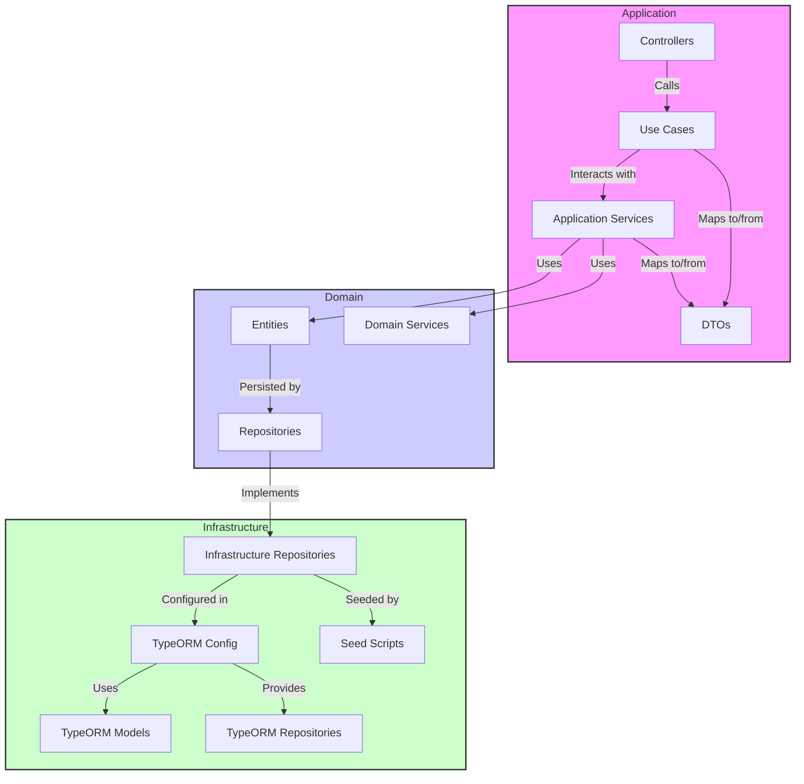
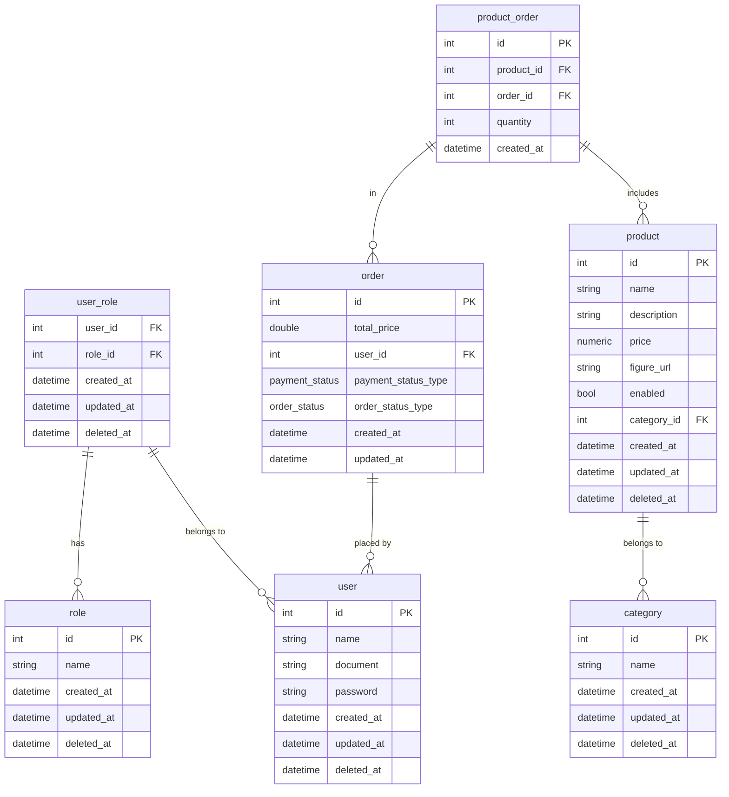

# Documentação do Projeto

## Visão Geral

Este projeto utiliza NestJS e TypeORM, seguindo a arquitetura limpa. A estrutura do projeto é organizada para promover uma separação clara de responsabilidades e facilitar a manutenção e escalabilidade.

## Event Storm

<a href="https://miro.com/app/board/uXjVKztqeIc=/?share_link_id=808693294741">
    
</a>

## Estrutura de Pastas

Abaixo está a estrutura de pastas do projeto:

```
.
├── application/
│   ├── controllers/
│   ├── dtos/
│   ├── mappers/
│   └── use-cases/
├── domain/
│   ├── entities/
│   ├── repositories/
│   └── services/
├── infrastructure/
│   ├── services/
│   ├── typeorm/
│   │   ├── config/
│   │   ├── mappers/
│   │   ├── models/
│   │   ├── repositories/
│   │   └── seed/
└── shared/
    ├── config/
    ├── enums/
    └── utils/
```

### application

A camada de `application` contém a lógica específica do aplicativo, incluindo a comunicação entre as entidades do domínio e a infraestrutura.

- **controllers**: Contém os controladores responsáveis por lidar com as requisições HTTP e invocar os casos de uso apropriados.
- **dtos**: Contém os Data Transfer Objects (DTOs) usados para transferir dados entre a aplicação e a camada de apresentação.
- **mappers**: Contém as classes responsáveis por mapear entidades para DTOs e vice-versa.
- **use-cases**: Contém os casos de uso que definem a lógica de negócio e orquestram as operações entre o domínio e a infraestrutura.

### domain

A camada de `domain` é onde reside a lógica de negócio e as regras de domínio.

- **entities**: Contém as entidades que representam os modelos de dados do domínio.
- **repositories**: Define as interfaces dos repositórios para manipulação das entidades.
- **services**: Contém os serviços de domínio que encapsulam a lógica de negócio.

### infrastructure

A camada de `infrastructure` fornece as implementações necessárias para suportar a camada de domínio e a aplicação.

- **services**: Contém serviços de infraestrutura que podem ser utilizados pela aplicação.
- **typeorm**: Contém a configuração e implementação relacionada ao TypeORM.
  - **config**: Contém arquivos de configuração do TypeORM.
  - **mappers**: Contém mapeamentos específicos para entidades e DTOs.
  - **models**: Contém os modelos de dados específicos da implementação do TypeORM.
  - **repositories**: Implementações dos repositórios definidos na camada de domínio.
  - **seed**: Scripts e dados para inicializar o banco de dados.

### shared

A camada `shared` contém utilitários e recursos comuns usados em várias partes do projeto.

- **config**: Contém arquivos de configuração compartilhados.
- **enums**: Contém enums utilizados em diferentes partes do projeto.
- **utils**: Contém funções utilitárias e helpers.

## Diagrama de Arquitetura

O diagrama abaixo ilustra a interação entre as camadas e componentes do projeto:



## Documentação do Banco de Dados

Este documento descreve a estrutura do banco de dados utilizado no projeto. Inclui a descrição de cada tabela, suas colunas e os relacionamentos entre elas.

### Tabelas de Usuário

#### `user`
| Coluna       | Tipo       | Detalhes                                   |
|--------------|------------|-------------------------------------------|
| `id`          | `int`       | Chave primária, auto-incremento           |
| `name`        | `string`    | Nome do usuário                           |
| `document`    | `string`    | Documento de identidade                   |
| `password`    | `string`    | Senha do usuário                          |
| `created_at`  | `datetime`  | Data de criação                           |
| `updated_at`  | `datetime`  | Data de atualização                       |
| `deleted_at`  | `datetime`  | Data de exclusão (soft delete)            |

#### `role`
| Coluna       | Tipo       | Detalhes                                   |
|--------------|------------|-------------------------------------------|
| `id`          | `int`       | Chave primária, auto-incremento           |
| `name`        | `string`    | Nome da função                            |
| `created_at`  | `datetime`  | Data de criação                           |
| `updated_at`  | `datetime`  | Data de atualização                       |
| `deleted_at`  | `datetime`  | Data de exclusão (soft delete)            |

#### `user_role`
| Coluna       | Tipo       | Detalhes                                   |
|--------------|------------|-------------------------------------------|
| `user_id`     | `int`       | Chave estrangeira para `user`             |
| `role_id`     | `int`       | Chave estrangeira para `role`             |
| `created_at`  | `datetime`  | Data de criação                           |
| `updated_at`  | `datetime`  | Data de atualização                       |
| `deleted_at`  | `datetime`  | Data de exclusão (soft delete)            |

### Tabelas de Pedido

#### `order`
| Coluna             | Tipo        | Detalhes                                    |
|--------------------|-------------|--------------------------------------------|
| `id`               | `int`        | Chave primária, auto-incremento            |
| `total_price`      | `double`     | Preço total do pedido                      |
| `user_id`          | `int`        | Chave estrangeira para `user`              |
| `payment_status`   | `enum`       | Status de pagamento (`pending`, `approved`, `canceled`) |
| `order_status`     | `enum`       | Status do pedido (`none`, `received`, `in_preparation`, `ready`, `finished`) |
| `created_at`       | `datetime`   | Data de criação                            |
| `updated_at`       | `datetime`   | Data de atualização                        |

#### `product_order`
| Coluna       | Tipo       | Detalhes                                   |
|--------------|------------|-------------------------------------------|
| `id`          | `int`       | Chave primária, auto-incremento           |
| `product_id`  | `int`       | Chave estrangeira para `product`          |
| `quantity`    | `int`       | Quantidade do produto                     |
| `order_id`    | `int`       | Chave estrangeira para `order`            |
| `created_at`  | `datetime`  | Data de criação                           |

### Tabelas de Produto

#### `product`
| Coluna         | Tipo       | Detalhes                                    |
|----------------|------------|--------------------------------------------|
| `id`            | `int`       | Chave primária, auto-incremento            |
| `name`          | `string`    | Nome do produto                            |
| `description`   | `string`    | Descrição do produto                       |
| `price`         | `numeric`   | Preço do produto                           |
| `figure_url`    | `string`    | URL da imagem do produto                   |
| `enabled`       | `bool`      | Se o produto está ativado                  |
| `category_id`   | `int`       | Chave estrangeira para `category`          |
| `created_at`    | `datetime`  | Data de criação                            |
| `updated_at`    | `datetime`  | Data de atualização                        |
| `deleted_at`    | `datetime`  | Data de exclusão (soft delete)             |

#### `category`
| Coluna         | Tipo       | Detalhes                                    |
|----------------|------------|--------------------------------------------|
| `id`            | `int`       | Chave primária, auto-incremento            |
| `name`          | `string`    | Nome da categoria                          |
| `created_at`    | `datetime`  | Data de criação                            |
| `updated_at`    | `datetime`  | Data de atualização                        |
| `deleted_at`    | `datetime`  | Data de exclusão (soft delete)             |

### Diagrama do Banco de Dados

O diagrama abaixo ilustra a estrutura das tabelas e suas relações:



### Detalhes Adicionais

- **Chave Primária (PK)**: Identificador único de cada registro na tabela.
- **Chave Estrangeira (FK)**: Referência a registros em outras tabelas.
- **Soft Delete**: Colunas `deleted_at` usadas para implementar exclusão lógica.

## Como Contribuir

Para contribuir com o projeto, por favor, siga estas diretrizes:

1. **Clone o repositório**: `git clone <URL do repositório>`
2. **Crie uma branch para suas alterações**: `git checkout -b minha-nova-feature`
3. **Faça suas alterações e adicione testes**.
4. **Envie suas alterações**: `git commit -am 'Adiciona nova feature'`
5. **Faça um push para a branch**: `git push origin minha-nova-feature`
6. **Crie um pull request**.

## Como Executar o Projeto

Para executar o projeto, siga estes passos:

1. **Instale as dependências**: `npm install`
2. **Configure o banco de dados**: Ajuste as configurações no arquivo `ormconfig.json` em `infraestructure/typeorm/config`.
3. **Execute as migrations** (se houver): `npm run typeorm migration:run`
4. **Inicie o servidor**: `npm run start:dev`

## Contato

Para dúvidas ou suporte, entre em contato com:

- Jhoni Farias (jhonifarias.developer@gmail.com)
- Josef ()
- Lucas Rodrigues Medina Costa (lucasmedinarmc@gmail.com)
- Kleber de Oliveira Andrade (pdjkleber@gmail.com)
- Victória ()
