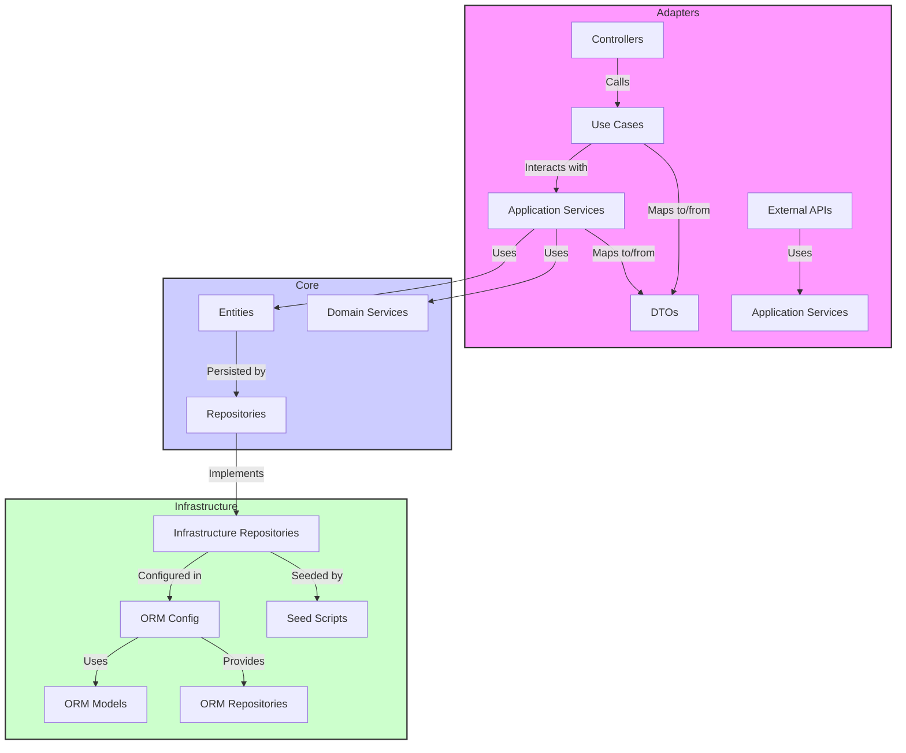
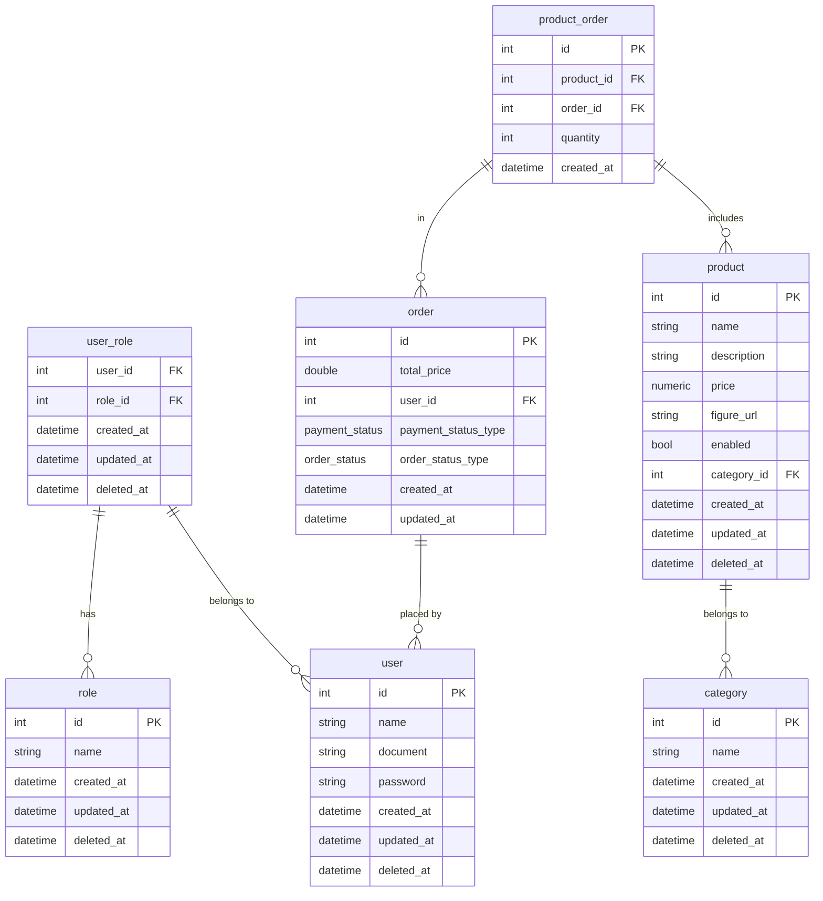

# Documentação do Projeto

Bem-vindo à documentação da API. Esta API foi desenvolvida utilizando NestJS e TypeORM, seguindo a arquitetura hexagonal. Abaixo está a descrição detalhada da estrutura do projeto e suas responsabilidades.

## Event Storm


O **Event Storm** é uma técnica valiosa utilizada para explorar e mapear o domínio do problema antes de começar o desenvolvimento. Ele ajuda a entender melhor os processos e eventos que ocorrem no sistema, facilitando a modelagem e a estruturação da arquitetura do software.

Para obter uma visão detalhada do Event Storm aplicado a este projeto, incluindo o diagrama visual que foi utilizado para guiar o desenvolvimento, você pode acessar o link abaixo:


<a href="https://miro.com/app/board/uXjVKztqeIc=/?share_link_id=808693294741">
    
</a>

## Estrutura de Pastas

Esta API foi desenvolvida utilizando NestJS e TypeORM, seguindo a arquitetura hexagonal. Abaixo está a descrição detalhada da estrutura do projeto e suas responsabilidades.

```
src/
├── core/
│ ├── domain/
│ │ ├── entities/ 
│ │ ├── value-objects/ 
│ │ ├── services/ 
│ │ ├── repositories/ 
│ └── application/
│ ├── use-cases/
│ ├── ports/ 
│ ├── dtos/
│ └── mappers/ 
├── adapters/
│ ├── in/ 
│ └── out/ 
├── infrastructure/
│ ├── orm/ 
│ ├── services/ 
│ └── config/
├── shared/ 
└── main.ts 
```

## Descrição das Pastas e Arquivos

### `src/core/domain/`

- **`entities/`**: Contém as entidades do domínio, que representam os modelos principais do sistema e estão mapeados para o banco de dados.
- **`value-objects/`**: Contém os Objetos de Valor do domínio, que são objetos imutáveis que possuem um valor específico e são utilizados em conjunto com as entidades.
- **`services/`**: Contém serviços que implementam as regras de negócio puras do domínio, sem depender de detalhes de infraestrutura ou aplicação.
- **`repositories/`**: Contém interfaces para repositórios, que são portas de saída para a persistência de dados.

### `src/core/application/`

- **`use-cases/`**: Contém casos de uso da aplicação, que definem as operações específicas que a aplicação pode realizar e coordenam as interações entre entidades e serviços.
- **`ports/`**: Contém interfaces de entrada e saída (ports) para os casos de uso da aplicação. Define como a aplicação interage com o mundo exterior e como os casos de uso são chamados.
- **`dtos/`**: Contém Data Transfer Objects, que são utilizados para transferir dados entre diferentes camadas da aplicação.
- **`mappers/`**: Contém mapeamentos entre entidades e DTOs para facilitar a conversão de dados entre o formato de persistência e o formato de apresentação.

### `src/adapters/`

- **`in/`**: Contém adaptadores de entrada, como controladores HTTP, que recebem as requisições dos clientes e invocam os casos de uso apropriados.
- **`out/`**: Contém adaptadores de saída, como repositórios e integrações com APIs externas, que implementam a persistência de dados e outras interações externas.

### `src/infrastructure/`

- **`orm/`**: Contém configurações e implementações específicas do ORM (TypeORM), como conexões com o banco de dados e definições de entidades.
- **`services/`**: Contém serviços de infraestrutura que oferecem funcionalidades auxiliares para a aplicação, como serviços de cache ou de mensageria.
- **`config/`**: Contém configurações da aplicação, como variáveis de ambiente e configurações específicas do sistema.

### `src/shared/`

- **`shared/`**: Contém código e configurações compartilhadas que são usadas em várias partes da aplicação, como utilitários comuns e configurações globais.

### `src/main.ts`

- **`main.ts`**: Ponto de entrada da aplicação. Configura e inicializa o módulo principal do NestJS e inicia o servidor.


## Diagrama de Arquitetura Hexagonal

O diagrama abaixo ilustra a interação entre as diferentes camadas e componentes da arquitetura hexagonal do projeto. Esta arquitetura é projetada para promover uma separação clara entre as diferentes responsabilidades do sistema, facilitando a manutenção e evolução da aplicação.



## Documentação do Banco de Dados

Este documento descreve a estrutura do banco de dados utilizado no projeto. Inclui a descrição de cada tabela, suas colunas e os relacionamentos entre elas.

### Tabelas de Usuário

#### `user`
| Coluna       | Tipo       | Detalhes                                   |
|--------------|------------|-------------------------------------------|
| `id`          | `int`       | Chave primária, auto-incremento           |
| `name`        | `string`    | Nome do usuário                           |
| `document`    | `string`    | Documento de identidade                   |
| `password`    | `string`    | Senha do usuário                          |
| `created_at`  | `datetime`  | Data de criação                           |
| `updated_at`  | `datetime`  | Data de atualização                       |
| `deleted_at`  | `datetime`  | Data de exclusão (soft delete)            |

#### `role`
| Coluna       | Tipo       | Detalhes                                   |
|--------------|------------|-------------------------------------------|
| `id`          | `int`       | Chave primária, auto-incremento           |
| `name`        | `string`    | Nome da função                            |
| `created_at`  | `datetime`  | Data de criação                           |
| `updated_at`  | `datetime`  | Data de atualização                       |
| `deleted_at`  | `datetime`  | Data de exclusão (soft delete)            |

#### `user_role`
| Coluna       | Tipo       | Detalhes                                   |
|--------------|------------|-------------------------------------------|
| `user_id`     | `int`       | Chave estrangeira para `user`             |
| `role_id`     | `int`       | Chave estrangeira para `role`             |
| `created_at`  | `datetime`  | Data de criação                           |
| `updated_at`  | `datetime`  | Data de atualização                       |
| `deleted_at`  | `datetime`  | Data de exclusão (soft delete)            |

### Tabelas de Pedido

#### `order`
| Coluna             | Tipo        | Detalhes                                    |
|--------------------|-------------|--------------------------------------------|
| `id`               | `int`        | Chave primária, auto-incremento            |
| `total_price`      | `double`     | Preço total do pedido                      |
| `user_id`          | `int`        | Chave estrangeira para `user`              |
| `payment_status`   | `enum`       | Status de pagamento (`pending`, `approved`, `canceled`) |
| `order_status`     | `enum`       | Status do pedido (`none`, `received`, `in_preparation`, `ready`, `finished`) |
| `created_at`       | `datetime`   | Data de criação                            |
| `updated_at`       | `datetime`   | Data de atualização                        |

#### `product_order`
| Coluna       | Tipo       | Detalhes                                   |
|--------------|------------|-------------------------------------------|
| `id`          | `int`       | Chave primária, auto-incremento           |
| `product_id`  | `int`       | Chave estrangeira para `product`          |
| `quantity`    | `int`       | Quantidade do produto                     |
| `order_id`    | `int`       | Chave estrangeira para `order`            |
| `created_at`  | `datetime`  | Data de criação                           |

### Tabelas de Produto

#### `product`
| Coluna         | Tipo       | Detalhes                                    |
|----------------|------------|--------------------------------------------|
| `id`            | `int`       | Chave primária, auto-incremento            |
| `name`          | `string`    | Nome do produto                            |
| `description`   | `string`    | Descrição do produto                       |
| `price`         | `numeric`   | Preço do produto                           |
| `figure_url`    | `string`    | URL da imagem do produto                   |
| `enabled`       | `bool`      | Se o produto está ativado                  |
| `category_id`   | `int`       | Chave estrangeira para `category`          |
| `created_at`    | `datetime`  | Data de criação                            |
| `updated_at`    | `datetime`  | Data de atualização                        |
| `deleted_at`    | `datetime`  | Data de exclusão (soft delete)             |

#### `category`
| Coluna         | Tipo       | Detalhes                                    |
|----------------|------------|--------------------------------------------|
| `id`            | `int`       | Chave primária, auto-incremento            |
| `name`          | `string`    | Nome da categoria                          |
| `created_at`    | `datetime`  | Data de criação                            |
| `updated_at`    | `datetime`  | Data de atualização                        |
| `deleted_at`    | `datetime`  | Data de exclusão (soft delete)             |

### Diagrama do Banco de Dados

O diagrama abaixo ilustra a estrutura das tabelas e suas relações:



### Detalhes Adicionais

- **Chave Primária (PK)**: Identificador único de cada registro na tabela.
- **Chave Estrangeira (FK)**: Referência a registros em outras tabelas.
- **Soft Delete**: Colunas `deleted_at` usadas para implementar exclusão lógica.


## Como Executar o Projeto

### Utilizando Docker

Para executar o projeto utilizando Docker, siga os passos abaixo:

1. **Certifique-se de que o Docker e o Docker Compose estão instalados**:
   
   - [Docker](https://www.docker.com/get-started)
   - [Docker Compose](https://docs.docker.com/compose/install/)

2. **Clone o repositório** (se ainda não o fez):

```bash
git clone https://github.com/diname/tech-challenge-fiap
cd seu-repositorio
```

3. **Construa a Imagem Docker**:

Construa a imagem Docker da aplicação usando o Dockerfile fornecido:

```bash
docker build -t my-app .
```

Substitua my-app pelo nome desejado para a imagem.

4. **Inicie os Contêineres com Docker Compose**:

Utilize o docker-compose.yml para iniciar a aplicação e os serviços dependentes (como o banco de dados):

```bash
docker-compose up
```

Isso iniciará todos os serviços definidos no **docker-compose.yml**. Você verá os logs da aplicação no terminal.

1. **Acessar o Swagger**:

Após iniciar os contêineres, o Swagger estará acessível em [http://localhost:3000/docs](http://localhost:3000/docs) (ou a porta definida no docker-compose.yml).

## Contato

Para dúvidas ou suporte, entre em contato com:

- Jhoni Farias (jhonifarias.developer@gmail.com)
- Josef Henrique Zambreti (josefhenrique@uol.com.br)
- Lucas Rodrigues Medina Costa (lucasmedinarmc@gmail.com)
- Kleber de Oliveira Andrade (pdjkleber@gmail.com)
- Victória ()
