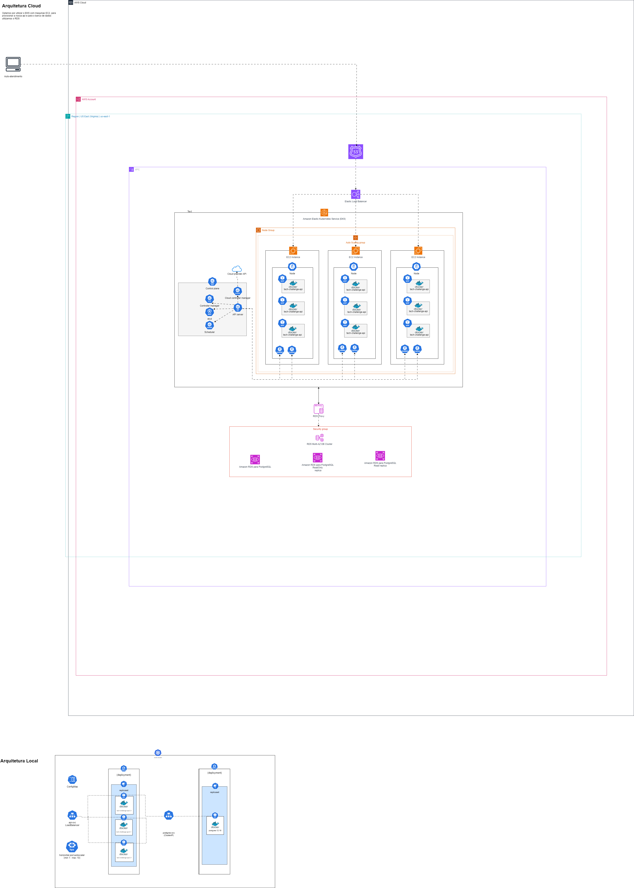
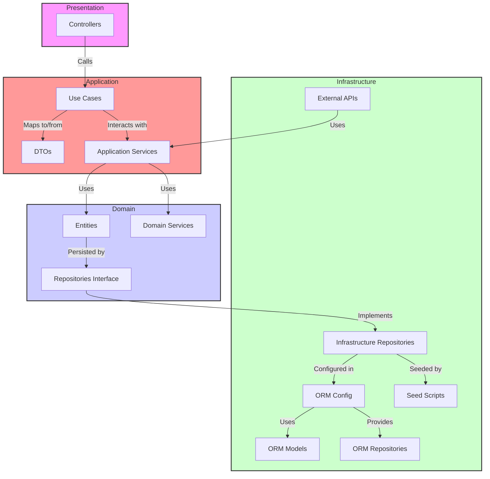
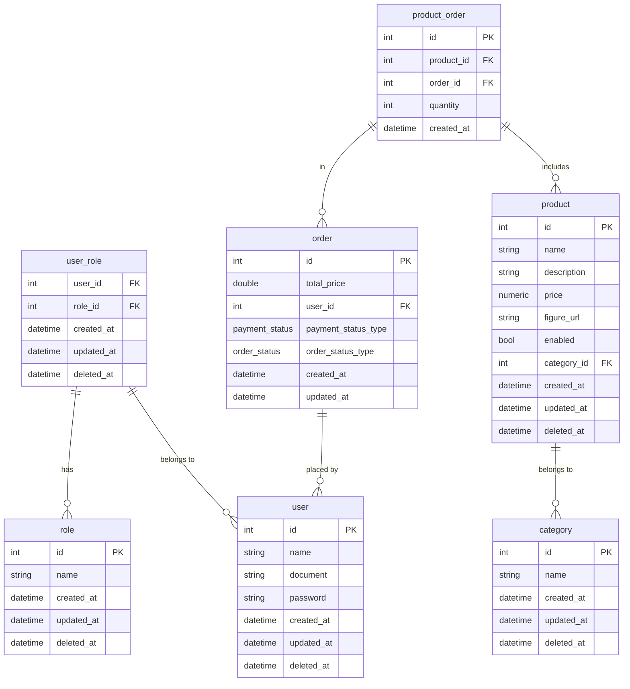

# Tech Challenge (Software Architecture)

Tech Challenge é o projeto do MBA em Software Architecture que engloba os conhecimentos obtidos nas disciplinas.

## O Problema

Há uma lanchonete de bairro que está expandindo devido seu grande sucesso. Porém, com a expansão e sem um sistema de controle de pedidos, o atendimento aos clientes pode ser caótico e confuso. Por exemplo, imagine que um cliente faça um pedido complexo, como um hambúrguer personalizado com ingredientes específicos, acompanhado de batatas fritas e uma bebida. O atendente pode anotar o pedido em um papel e entregá-lo à cozinha, mas não há garantia de que o pedido será preparado corretamente.

Sem um sistema de controle de pedidos, pode haver confusão entre os atendentes e a cozinha, resultando em atrasos na preparação e entrega dos pedidos. Os pedidos podem ser perdidos, mal interpretados ou esquecidos, levando à insatisfação dos clientes e a perda de negócios.

Em resumo, um sistema de controle de pedidos é essencial para garantir que a lanchonete possa atender os clientes de maneira eficiente, gerenciando seus pedidos e estoques de forma adequada. Sem ele, expandir a lanchonete pode acabar não dando certo, resultando em clientes insatisfeitos e impactando os negócios de forma negativa.

### Fase 1

Para solucionar o problema, a lanchonete irá investir em um sistema de autoatendimento de fast food, que é composto por uma série de dispositivos e interfaces que permitem aos clientes selecionar e fazer pedidos sem precisar interagir com um atendente, com as seguintes funcionalidades:

**Pedido**: Os clientes são apresentados a uma interface de seleção na qual podem optar por se identificarem via CPF, se cadastrarem com nome, e-mail ou não se identificar, podendo montar o combo na seguinte sequência, sendo todas elas opcionais:

1. Lanche
2. Acompanhamento
3. Bebida

Em cada etapa é exibido o nome, descrição e preço de cada produto..

**Pagamento**: O sistema deverá possuir uma opção de pagamento integrada para MVP. A forma de pagamento oferecida será via QRCode do Mercado Pago.

Acompanhamento: Uma vez que o pedido é confirmado e pago, ele é enviado para a cozinha para ser preparado. Simultaneamente deve aparecer em um monitor para o cliente acompanhar o progresso do seu pedido com as seguintes etapas:

- Recebido
- Em preparação
- Pronto
- Finalizado

**Entrega**: Quando o pedido estiver pronto, o sistema deverá notificar o cliente que ele está pronto para retirada. Ao ser retirado, o pedido deve ser atualizado para o status finalizado.

Além das etapas do cliente, o estabelecimento precisa de um acesso administrativo:

**Gerenciar clientes**: Com a identificação dos clientes o estabelecimento pode trabalhar em campanhas promocionais.

**Gerenciar produtos e categorias**: Os produtos dispostos para escolha do cliente serão gerenciados pelo estabelecimento, definindo nome, categoria, preço, descrição e imagens. Para esse sistema teremos categorias fixas:

- Lanche
- Acompanhamento
- Bebida
- Sobremesa

**Acompanhamento de pedidos**: Deve ser possível acompanhar os pedidos em andamento e tempo de espera de cada pedido.

As informações dispostas no sistema de pedidos precisarão ser gerenciadas pelo estabelecimento através de um painel administrativo.

## Event Storm

O **Event Storm** é uma técnica valiosa utilizada para explorar e mapear o domínio do problema antes de começar o desenvolvimento. Ele ajuda a entender melhor os processos e eventos que ocorrem no sistema, facilitando a modelagem e a estruturação da arquitetura do software.

Para obter uma visão detalhada do Event Storm aplicado a este projeto, incluindo o diagrama visual que foi utilizado para guiar o desenvolvimento, você pode acessar o link abaixo:

<a href="https://miro.com/app/board/uXjVKztqeIc=/?share_link_id=808693294741">
    
</a>

## Arquitetura

[Clique aqui para ver no draw.io](https://drive.google.com/file/d/125nhmEe8Vd6zaZj_OnBLJ8eRhIvvUyDZ/view?usp=sharing)↗️


_Clique na imagem para ampliar._

## Estrutura de Pastas

Este documento descreve a estrutura de pastas da aplicação baseada na Clean Architecture. Essa organização visa garantir uma separação clara de responsabilidades entre as diferentes camadas do sistema, facilitando a manutenção e evolução da aplicação.

```
src/
├── domain/
│   ├── entities/
│   ├── value-objects/
│   ├── services/
│   └── repositories/
│
├── application/
│   ├── use-cases/
│   ├── dtos/
│   └── mappers/
│
├── infrastructure/
│   ├── orm/
│   ├── repositories/
│   └── config/
│
├── presentation/
│   └── controllers/
│
└── main.ts
```

## Descrição das Pastas e Arquivos

### `src/domain/`

- **`entities/`**: Contém as entidades do domínio, que representam os modelos principais do sistema.
- **`value-objects/`**: Contém os Objetos de Valor do domínio, que são objetos imutáveis utilizados em conjunto com as entidades.
- **`services/`**: Contém serviços que implementam as regras de negócio puras do domínio, sem depender de detalhes de infraestrutura.
- **`repositories/`**: Contém interfaces para repositórios, que são portas de saída para a persistência de dados.

### `src/application/`

- **`use-cases/`**: Contém casos de uso da aplicação, que definem as operações específicas que a aplicação pode realizar e coordenam as interações entre entidades e serviços.
- **`dtos/`**: Contém Data Transfer Objects, que são utilizados para transferir dados entre diferentes camadas da aplicação.
- **`mappers/`**: Contém mapeamentos entre entidades e DTOs para facilitar a conversão de dados entre o formato de persistência e o formato de apresentação.

### `src/presentation/`

- **`controllers/`**: Contém adaptadores de entrada, como controladores HTTP, que recebem as requisições dos clientes e invocam os casos de uso apropriados.

### `src/infrastructure/`

- **`typeorm/`**: Contém configurações e implementações específicas do ORM (TypeORM), como conexões com o banco de dados e definições de entidades.
- **`repositories/`**: Contém a implementação concreta dos repositórios definidos no domínio.
- **`services/`**: Contém serviços de infraestrutura que oferecem funcionalidades auxiliares para a aplicação, como serviços de cache ou de mensageria.
- **`config/`**: Contém configurações da aplicação, como variáveis de ambiente e configurações específicas do sistema.

### `src/shared/`

- **`shared/`**: Contém código e configurações compartilhadas que são usadas em várias partes da aplicação, como utilitários comuns e configurações globais.

### `src/main.ts`

- **`main.ts`**: Ponto de entrada da aplicação. Configura e inicializa o módulo principal do NestJS e inicia o servidor.

## Diagrama de Arquitetura Limpa

O diagrama abaixo ilustra a interação entre as diferentes camadas e componentes da arquitetura limpa do projeto. Esta arquitetura é projetada para promover uma separação clara entre as diferentes responsabilidades do sistema, facilitando a manutenção e evolução da aplicação.



## Documentação do Banco de Dados

Este documento descreve a estrutura do banco de dados utilizado no projeto. Inclui a descrição de cada tabela, suas colunas e os relacionamentos entre elas.

### Tabelas de Usuário

#### `user`

| Coluna       | Tipo       | Detalhes                        |
| ------------ | ---------- | ------------------------------- |
| `id`         | `int`      | Chave primária, auto-incremento |
| `name`       | `string`   | Nome do usuário                 |
| `document`   | `string`   | Documento de identidade         |
| `password`   | `string`   | Senha do usuário                |
| `created_at` | `datetime` | Data de criação                 |
| `updated_at` | `datetime` | Data de atualização             |
| `deleted_at` | `datetime` | Data de exclusão (soft delete)  |

#### `role`

| Coluna       | Tipo       | Detalhes                        |
| ------------ | ---------- | ------------------------------- |
| `id`         | `int`      | Chave primária, auto-incremento |
| `name`       | `string`   | Nome da função                  |
| `created_at` | `datetime` | Data de criação                 |
| `updated_at` | `datetime` | Data de atualização             |
| `deleted_at` | `datetime` | Data de exclusão (soft delete)  |

#### `user_role`

| Coluna       | Tipo       | Detalhes                       |
| ------------ | ---------- | ------------------------------ |
| `user_id`    | `int`      | Chave estrangeira para `user`  |
| `role_id`    | `int`      | Chave estrangeira para `role`  |
| `created_at` | `datetime` | Data de criação                |
| `updated_at` | `datetime` | Data de atualização            |
| `deleted_at` | `datetime` | Data de exclusão (soft delete) |

### Tabelas de Pedido

#### `order`

| Coluna           | Tipo       | Detalhes                                                                     |
| ---------------- | ---------- | ---------------------------------------------------------------------------- |
| `id`             | `int`      | Chave primária, auto-incremento                                              |
| `total_price`    | `double`   | Preço total do pedido                                                        |
| `user_id`        | `int`      | Chave estrangeira para `user`                                                |
| `payment_status` | `enum`     | Status de pagamento (`pending`, `approved`, `canceled`)                      |
| `order_status`   | `enum`     | Status do pedido (`none`, `received`, `in_preparation`, `ready`, `finished`) |
| `created_at`     | `datetime` | Data de criação                                                              |
| `updated_at`     | `datetime` | Data de atualização                                                          |

#### `product_order`

| Coluna       | Tipo       | Detalhes                         |
| ------------ | ---------- | -------------------------------- |
| `id`         | `int`      | Chave primária, auto-incremento  |
| `product_id` | `int`      | Chave estrangeira para `product` |
| `quantity`   | `int`      | Quantidade do produto            |
| `order_id`   | `int`      | Chave estrangeira para `order`   |
| `created_at` | `datetime` | Data de criação                  |

### Tabelas de Produto

#### `product`

| Coluna        | Tipo       | Detalhes                          |
| ------------- | ---------- | --------------------------------- |
| `id`          | `int`      | Chave primária, auto-incremento   |
| `name`        | `string`   | Nome do produto                   |
| `description` | `string`   | Descrição do produto              |
| `price`       | `numeric`  | Preço do produto                  |
| `figure_url`  | `string`   | URL da imagem do produto          |
| `enabled`     | `bool`     | Se o produto está ativado         |
| `category_id` | `int`      | Chave estrangeira para `category` |
| `created_at`  | `datetime` | Data de criação                   |
| `updated_at`  | `datetime` | Data de atualização               |
| `deleted_at`  | `datetime` | Data de exclusão (soft delete)    |

#### `category`

| Coluna       | Tipo       | Detalhes                        |
| ------------ | ---------- | ------------------------------- |
| `id`         | `int`      | Chave primária, auto-incremento |
| `name`       | `string`   | Nome da categoria               |
| `created_at` | `datetime` | Data de criação                 |
| `updated_at` | `datetime` | Data de atualização             |
| `deleted_at` | `datetime` | Data de exclusão (soft delete)  |

### Diagrama do Banco de Dados

O diagrama abaixo ilustra a estrutura das tabelas e suas relações:



### Detalhes Adicionais

- **Chave Primária (PK)**: Identificador único de cada registro na tabela.
- **Chave Estrangeira (FK)**: Referência a registros em outras tabelas.
- **Soft Delete**: Colunas `deleted_at` usadas para implementar exclusão lógica.

## Como Executar o Projeto

1. **Clone o repositório** (se ainda não o fez):

```bash
git clone https://github.com/diname/tech-challenge-fiap
cd tech-challenge-fiap
```

### Utilizando Docker

Para executar o projeto utilizando Docker, siga os passos abaixo:

1. **Certifique-se de que o Docker e o Docker Compose estão instalados**:

   - [Docker](https://www.docker.com/get-started)
   - [Docker Compose](https://docs.docker.com/compose/install/)

2. **Inicie os Contêineres com Docker Compose**:

Utilize o docker-compose.yml para iniciar a aplicação e os serviços dependentes (como o banco de dados):

```bash
docker compose up
```

Isso iniciará todos os serviços definidos no **docker-compose.yml**. Você verá os logs da aplicação no terminal.

### **Acessando o Swagger**

Após iniciar os contêineres, o Swagger estará acessível em [http://localhost:3000/docs](http://localhost:3000/docs) (ou a porta definida no docker-compose.yml).

> ⚠️ **Atenção**
>
> [Instruções de fluxo](https://github.com/diname/tech-challenge-fiap/wiki/Fluxo-de-teste)

## Contato (Grupo)

Para dúvidas ou suporte, entre em contato com:

- **RM357358** Jhoni Farias (jhonifarias.developer@gmail.com)
- **RM357836** Josef Henrique Zambreti (josefhenrique@uol.com.br)
- **RM357360** Lucas Rodrigues Medina Costa (lucasmedinarmc@gmail.com)
- **RM358012** Kleber de Oliveira Andrade (pdjkleber@gmail.com)
- **RM357235** Vitória Camila Xavier Sobrinho (vcamilaxs@gmail.com)
