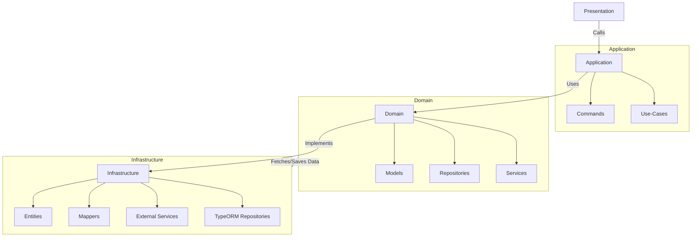

# tech-challenge-fiap
Repositório para o Tech Challenge da Faculdade FIAP


## Estrutura de Pastas

A estrutura do projeto é organizada em várias camadas para promover uma arquitetura limpa e escalável. Cada camada tem uma responsabilidade distinta. Abaixo está uma visão geral da estrutura de pastas:


```typeorm
.
├── application/
│   ├── commands/
│   └── use-cases/
├── domain/
│   ├── models/
│   ├── repositories/
│   └── services/
├── infrastructure/
│   ├── entities/
│   ├── mappers/
│   ├── external-services/
│   └── typeorm/
├── presentation/
│   ├── controllers/
│   └── dto/
└── shared/
    ├── enums/
    ├── interfaces/
    └── utils/
```

### Descrição das Camadas

- **application/**: Contém a lógica da aplicação e coordena as operações entre serviços e repositórios.
  - `commands/`: Representa ações específicas que a aplicação pode realizar.
  - `use-cases/`: Implementa a lógica de aplicação principal.

- **domain/**: O núcleo da lógica de negócio, independente de detalhes de infraestrutura.
  - `models/`: Define as entidades de domínio e suas propriedades.
  - `repositories/`: Interfaces para operações de persistência de dados.
  - `services/`: Implementações da lógica de negócio central.

- **infrastructure/**: Implementações técnicas e detalhes específicos.
  - `entities/`: Mapeamentos ORM das tabelas do banco de dados.
  - `mappers/`: Converte entre entidades e modelos de domínio.
  - `external-services/`: Integrações com serviços externos.
  - `typeorm/`: Implementações concretas dos repositórios usando TypeORM.

- **presentation/**: Lida com a comunicação externa e a exposição da API.
  - `controllers/`: Pontos de entrada que recebem requisições HTTP.
  - `dto/`: Objetos de Transferência de Dados (DTOs) para estruturar dados.

- **shared/**: Recursos e utilitários compartilhados.
  - `enums/`: Definições de tipos enumerados.
  - `interfaces/`: Contratos para garantir consistência.
  - `utils/`: Funções utilitárias e helpers reutilizáveis.

## Diagrama da Arquitetura

O diagrama abaixo ilustra a estrutura e as interações entre as camadas do projeto:


```mermaid
graph TD
    A[Presentation] -->|Calls| B[Application]
    B -->|Uses| C[Domain]
    C -->|Implements| D[Infrastructure]
    
    subgraph Application
        B1[Commands]
        B2[Use-Cases]
        B --> B1
        B --> B2
    end

    subgraph Domain
        C1[Models]
        C2[Repositories]
        C3[Services]
        C --> C1
        C --> C2
        C --> C3
    end
    
    subgraph Infrastructure
        D1[Entities]
        D2[Mappers]
        D3[External Services]
        D4[TypeORM Repositories]
        D --> D1
        D --> D2
        D --> D3
        D --> D4
    end

    Domain -->|Fetches/Saves Data| Infrastructure
```